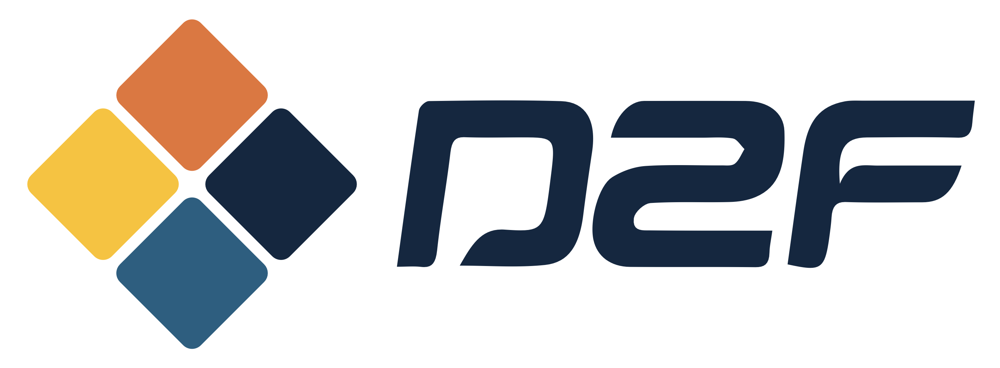

<p align="center">
    
</p>

# D2fEngine

vLLM implementation for Diffusion LLMs, D2F is integrated as the core inference strategy, while also support training-free strategies like Fast-dLLM.

## Foundation of Our vLLM Implementation

Based on [Nano-vLLM](https://github.com/GeeeekExplorer/nano-vllm).

## How We Implement


## Easy Install D2F-vLLM

```shell
pip install d2f_vllm
```

## Configure the Project from Source (for Developers)

We use [UV](https://github.com/astral-sh/uv) to manage the whole project. 

### Install UV

[UV Installation](https://docs.astral.sh/uv/getting-started/installation/)

### Initialize the Project

```shell
uv sync
source .venv/bin/activate
uv pip install -e .
```

For easy-activation:

```shell
echo "alias uvon=source .venv/bin/activate" >> ~/.zshrc # If using bash, change to .bashrc
source ~/.zshrc
```

Then, use `uvon` under the project root path to activate.

### Download vLLM

```shell
uv pip install vllm
```

`D2F-vLLM` still depends on some modules of `vLLM`, however, there are some problems lies in UV venv management, thus we have to install `vLLM` independently.

### Download Flash Attention (NO NEED RIGHT NOW)

```shell
uv pip install flash-attn --no-build-isolation
```

If not working, build `flash-attn` from scratch. This may take some while (most of the time is cost on compiling `cutlass`).

```shell
git submodule update --init --recursive
cd third_party/flash-attn
MAX_JOBS=$(nproc) python setup.py install --verbose
```

## User Guideline

### Setting Generation Mode

Setting `add_new_block_threshold<1.0`, together with our `D2F` training strategy, enables support for the D2F-specific decoding paradigm.

In contrast, setting `add_new_block_threshold=1.0` allows compatibility with Fast-dLLM inference, which is Training-free.

## TODO List

- [x] Implement KV Cache loading kernel
- [x] Tensor Parallel
- [x] Data Parallel
- [ ] Implement Async Engine and Streaming Generation
- [ ] Faster Flash Attention Kernel
- [ ] Diffusion LM CUDA Graph Capturing