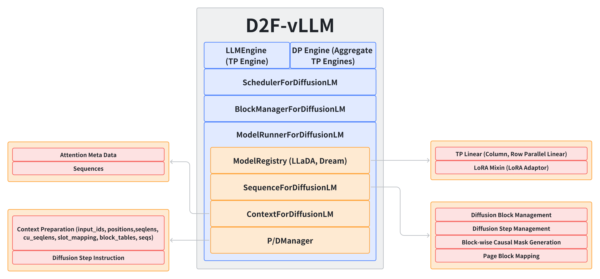

## **Nano-vLLM to D2F-vLLM**

### Highlights

#### 0x00. Basic vLLM Features

- **Paged Attention for dLLM**: Supports PagedAttention for Diffusion LLM to handle long sequences efficiently.
- **Dynamic Batching**: Supports dynamic batching with flexible sequence lengths.
- **Tensor Parallelism + Data Parallelism**: Supports tensor parallelism and data parallelism for efficient inference.

#### 0x01. Fully Support for D2F Inference

D2F-vLLM fully supports D2F inference: piplined block parallel decoding. Also, with proper configuration, it can support Block Diffusion inference without any training.

#### 0x02. Distinct KV Cache Layout (more efficient, developing)

***1. Fused Varlen Parallel Decoding Kernel***

The core algorithm the kernel comes from **FlashAttention2**. 

*Major points:*

- Shapes of inputs:
    - `q`: [TotalSeqLen, NumHeads, HeadDim]
    - `k`, `v`: [TotalSeqLen, NumKvHeads, HeadDim]
    - `kcache`: [NumPages, NumKvHeads, HeadDim // x, PageSize, x]
    - `vcache`: [NumPages, NumKvHeads, HeadDim, PageSize]
    - `mask`: [TotalSeqLen, TotalSeqLen] (block diagonal mask, inner mask is block-wise causal)

- Other inputs:
    - `page/block_table`: [NumSeqs, MaxNumPages]
    - `cu_seqlens_q`: [NumSeqs + 1]
    - `ctxlens`: [NumSeqs]
    - `total_seqlens`: [NumSeqs]
    - `slot_mapping`: [TotalSeqLen]

- Three **constexpr** parameters: `BLOCK_M` (for `q` tiles), `BLOCK_N` (for `kv` tiles), and `PAGE_SIZE` (for `kvcache` tiles).

- Three accumulation registers: `acc` (outputs, [BLOCK_M, BLOCK_N]), `m_i` (rowise max elems for online-softmax, [BLOCK_M, ]), and `l_i` (rowise factors of online-softmax, [BLOCK_M, ]).

*Kernel Pipeline:*

- **[STAGE 1] Attention Against KV Cache**: Load `kvcache` and compute attention of `q` & `kvcache` with fixed block size (tile size) equals to the `PAGE_SIZE` of `page/block_table`. Registering all the result of current block of q in `acc`, `m_i`, `l_i`.

- **[STAGE 2] Input QKV Self-Attention**: Load `kv` and compute attention of `q` & `kv` with fixed block size (tile size) equals to `BLOCK_N`, along with custom `mask` applying. Registering all the result of current block of q in `acc`, `m_i`, `l_i`. 

- **[STAGE 3] Output**: Store the result of `acc` to `out`.

***2. Parallel KV Cache Store Kernel (Distinct)***

***Parallel KV Cache Store Kernel (Distinct)*** is designed to store the KV cache in a distinct layout, which is more efficient for D2F-vLLM. 

What should be noted is that because the input `kv` is not all being stored every time call the kernel, thus the `slot_mapping` preparation process is way different that of traditional vLLM designed specifically for Auto-Regressive LLMs.

#### 0x03. Unified KV Cache Layout

***1. Parallel KV Cache Loading/Storing Kernels + FlexAttention Implemented Block Diagonal Attention***

*Major points:*

Except for the `kvcache` layout, the other inputs are the same to the ***Fused Varlen Parallel Decoding Kernel***.

- `kvcache`: [NumPages, PageSize, NumKvHeads, HeadDim] (same as the flash kv cache of vLLM, used for flash attention)

*Function Pipeline:*

The ***Parallel KV Cache Storing (Unified)*** is similar to the ***Parallel KV Cache Storing (Distinct)*** except for the fetching indices build-up procedure difference caused by the different `kvcache` layout.

Generate in-sequence-masks from `Sequence` , which is a block-wise causal mask, then in the `Context` post-init, generate the block-diagonal mask for the whole batched input sequence.

Using the block-diagonal mask, the ***FlexAttention Implemented Block Diagonal Attention*** can be used to compute the attention of `q` & `kvcache` with block sparsity.

## **Demo Benchmark**

### Configuration

| Parameter              | Value |
|------------------------|-------|
| enforce_eager          | True  |
| data_parallel_size     | 8     |
| tensor_parallel_size   | 1     |
| gpu_memory_utilization | 0.3   |
| max_num_batched_tokens | 5120  |
| max_num_seqs           | 20    |
| max_model_len          | 5120  |

**Devices**: 8x Nvidia H20-NVLink 96G 

### Dream-v0-Base-7B

#### GSM8K-CoT

| Metric             | Value                 |
|--------------------|-----------------------|
| Total Samples      | 1319                  |
| Total Tokens       | 336429                |

| Metric| D2F-vLLM| D2F-Baseline| Base Model|
|--------|--------|-----------|-----------|
| Total Time | 380.79 (92.8x) | 3693.20 (9.6x) | 35349.20 (1.0x) |
| TPS | 883.51 (93.0x) | 91.2 (9.6x) | 9.5 (1.0x) |
| AVG Latency | 0.29 (92.4x) | 2.8 (9.6x) | 26.8 (1.0x) |

#### HumanEval

| Metric             | Value                 |
|--------------------|-----------------------|
| Total Samples      | 164                   |
| Total Tokens       | 36198                 |

| Metric| D2F-vLLM| D2F-Baseline| Base Model|
|--------|--------|-----------|-----------|
| Total Time | 49.27 (41.9x) | 508.40 (4.1x) | 2066.4 (1.0x) |
| TPS | 734.68 (36.4x) | 73.2 (3.6x) | 20.2 (1.0x) |
| AVG Latency | 0.30 (42.0x) | 3.1 (4.1x) | 12.6 (1.0x) |